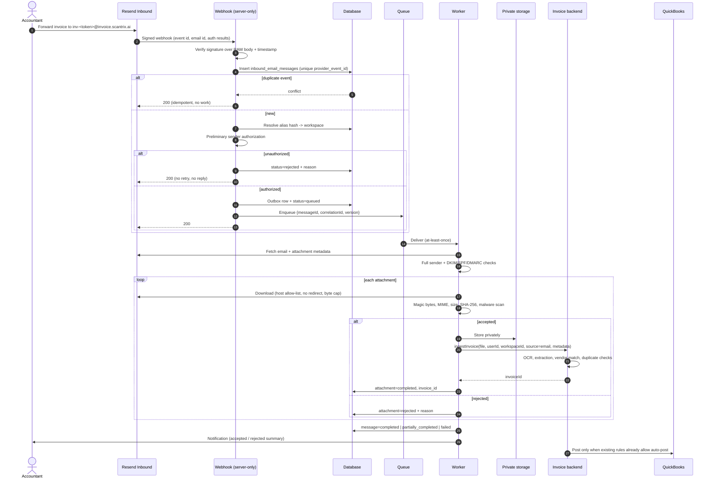

# Invoice Forwarding by Email — Architecture

Status: **implemented and deployable from this repository.**

Setup and testing: [`EMAIL_FORWARDING_DEPLOY.md`](./EMAIL_FORWARDING_DEPLOY.md).
**Read §0 first** — it records where this document was wrong and which sections it
supersedes. The rest of the document is the original design, kept because its
reasoning is still the reasoning; only the parts §0 names have changed.

Document convention: this repository has no `docs/` directory and keeps architecture
notes at the root (`architecture of chatbot.md`, `BACKEND_duplicate-bills.md`), so this
file follows that convention.

---

## 0. Implementation status and corrections

This document originally concluded the feature was **blocked on the backend
repository**. That conclusion was wrong, and three findings overturned it.

### 0.1 The provider's retry schedule IS the durable queue

§14 demanded a queue, a worker, and an outbox, and declared a Vercel route
handler unfit. But Resend redelivers a failed webhook **8 times over ~32 hours**
(immediately, 5s, 5m, 30m, 2h, 5h, 10h, 10h) and offers manual replay of any
delivery from its dashboard. That is an at-least-once queue with exponential
backoff and a dead-letter UI — already built and already operated.

So the pipeline runs synchronously inside the webhook, persisting progress as it
goes, and signals the queue with a status code: `503` means redeliver, `200`
means settled. §14's real prohibitions still hold and are still honoured —
no in-memory queues, no `setTimeout`, no fire-and-forget promises, no work that
dies with the request. What changed is only *whose* queue it is.

**Supersedes §14, and the queue/worker halves of §11 and §12.**

### 0.2 Vercel Blob is a datastore, and this repo already runs one

§4 concluded "no DB, no ORM" and therefore "persistence must live in the
backend". It overlooked `src/lib/chatHistory/store.ts`, which already operates a
private, ETag-guarded document store on Vercel Blob. Inbound volumes are far
smaller than chat history, and no attachment bytes are stored.

Layout in `src/lib/inboundEmail/store.ts`; see EMAIL_FORWARDING_DEPLOY.md for
the paths. **Supersedes §16** (the relational schema is now a document layout,
with the same keys and the same uniqueness properties — the alias pathname *is*
the unique index on `token_hash`, and a create-only write *is* the unique
constraint on `provider_event_id`).

### 0.3 Ingestion authority: delegation, not a service credential

§15 wanted `POST /internal/invoices/ingest` with a service credential. That
endpoint does not exist and cannot be built here.

Instead: when the accountant enables forwarding for a company, the browser hands
the server its **refresh token**, sealed with AES-256-GCM (bound to the alias's
token hash as AAD) and stored with the alias. Ingestion mints a short-lived
access token from it via the same `/auth/refresh-token` call `src/lib/api.ts`
already uses, and posts to the same `POST /invoices` with the same `X-QB-Id`.

§22's non-negotiable — one ingestion operation — is therefore satisfied more
literally than the original design managed: the backend genuinely cannot tell the
two channels apart. The cost is that we hold a long-lived credential at rest; the
handling is spelled out in `src/lib/inboundEmail/secretBox.ts` and in the deploy
runbook. `IngestAuthority` is the seam for swapping to §15's preferred design
later without touching the pipeline.

**Supersedes §15.**

### 0.4 Resend does not send authentication results — §5 and §9 were wrong

§5's provider table claimed "Auth results — Provider-validated SPF/DKIM/DMARC
surfaced on the event". Checked against Resend's API reference: **the
`email.received` payload carries no authentication results, no spam score, and no
envelope sender.** It carries `email_id`, `created_at`, `from`, `to`, `cc`,
`bcc`, `received_for`, `message_id`, `subject`, and a thin attachment list of
`{id, filename, content_type}`.

Consequences, all now implemented:

- Verdicts are parsed from the `Authentication-Results` header on the fetched
  message (`src/lib/inboundEmail/authResults.ts`).
- The envelope sender is approximated by `Return-Path`.
- The alias resolves from **`received_for`** — the envelope recipient. The
  original adapter read `data.envelope.to`, which does not exist. This mattered:
  a forwarded invoice frequently does not name our address in any visible
  header, so resolving from `to` alone would have dropped exactly the messages
  this feature exists to handle.
- The webhook event id comes from the **`svix-id` header**, not the body.
- **§9's `INBOUND_REQUIRE_EMAIL_AUTH` now defaults to `false`.** With `true` and
  no such header, every message would be rejected `authentication_failed`. The
  real gate is the verified-sender check (§8), not this flag. A diagnostics panel
  shows exactly which auth headers arrived so the flag can be tightened on
  evidence rather than on hope.

There is a caveat §9 could not have anticipated: Resend returns headers as a JSON
**object**, so duplicate `Authentication-Results` headers are collapsed before we
see them, and a forwarded message carries the original sender's headers too.
Pinning `INBOUND_EXPECTED_AUTHSERV_ID` is what makes the verdicts trustworthy;
until it is set they are reported as `advisory` rather than silently trusted.

**Supersedes the auth-results row of §5 and the default in §9.**

### 0.5 Sender authorization is tighter than §8 specified

§8 assumed a "look up a user by email" capability. No such endpoint exists on the
Savetrix API. So the authorized-sender set is captured **at enable time**: the
alias stores the owner's account email, read server-side from their profile and
never from the browser, plus an opt-in list of additional senders the owner adds.

This is *stricter* than §8 — the owner explicitly nominated who may forward into
their books — and it needs no per-message lookup. §8's ordering property is
preserved: alias before sender, so a probe with a bogus address never reveals
whether a sender is registered.

### 0.6 Duplicate-upload policy, made explicit

§18's layered idempotency assumed an `idempotencyKey` on the ingestion call.
`POST /invoices` accepts no such key, so one case is genuinely undecidable: an
attempt that uploaded a file and died before recording the outcome.

Policy: **do not re-upload.** The attachment is marked failed with a plain-English
reason and surfaced to the user. Rationale — the backend has no dedupe on
(connection, vendor, invoice number) (see `BACKEND_duplicate-bills.md`), so a
retry risks a second bill in QuickBooks, and `src/lib/api.ts` already applies
exactly this rule to any write that 401s. A rare manual re-forward beats a
duplicate bill.

### 0.7 Two defects fixed in the pre-existing modules

- `address.ts` and `attachment.ts` contained literal NUL and control bytes inside
  regex character classes. Valid JavaScript, but it made git treat both files as
  **binary** — no diffs, no review. Replaced with `\x00`-style escapes; behaviour
  is unchanged.
- The invoice-source badge (§23) cannot come from the backend, because emailed
  invoices use the same `POST /invoices` and there is no `source` column. We know
  which invoices we created, so the ids are recorded per user and served from
  `/api/inbound/sources`.

### 0.8 What is NOT implemented

- **Malware scanning** (§20 step 9). `MALWARE_SCAN_URL` is not wired up; no
  scanner exists to point it at. Magic-byte validation, MIME cross-checking,
  format deny-listing, and size caps all are. This is the largest remaining gap
  and should be closed before high-volume rollout.
- **`message/rfc822` nesting** (§20). Forward-as-attachment is not unwrapped;
  such a message reports `no_supported_attachments`.
- **Retention sweeping** (§25). `store.pruneMessages()` exists but is not on a
  schedule.
- **Per-alias rate limiting** (§10). Relies on the provider's own limits today.
- Everything else in §31's known-limitations list still stands.

---

## 1. Problem statement

Accountants receive supplier invoices by email, then download each attachment and
re-upload it through the Scantrix dashboard. The download/re-upload step is pure
friction and is where invoices get lost or duplicated.

We want forwarding an email to a Scantrix address to be equivalent to uploading the
attachment by hand — same extraction, same vendor resolution, same review, same
duplicate detection, same QuickBooks posting.

## 2. Goals and non-goals

**Goals**

- Email becomes an additional *ingestion channel*, not a second invoice pipeline.
- Only a registered, verified, active, authorized user can cause an invoice to exist.
- The target workspace/QuickBooks connection is unambiguous.
- Asynchronous, durable, idempotent, observable, replayable.
- Attachments are treated as hostile input.

**Non-goals (this version)**

- Fetching invoice links found in email bodies.
- Parsing invoice data out of the email body itself.
- Inbound replies/threading, or an email-based approval workflow.
- Non-QuickBooks accounting targets (the existing pipeline already gates that).

## 3. Existing Scantrix workflow (with repository references)

Manual upload, traced end to end:

| Step | Location |
|---|---|
| Drag/drop or file picker (`accept="image/*,.pdf"`, up to 20 files) | `src/components/dashboard/DashboardContent.tsx:108,127` |
| Per-file dispatch loop, progress, failure toast, unconditional refresh | `src/components/dashboard/DashboardContent.tsx` (upload handler) |
| `scanInvoice` thunk — builds `FormData`, appends `files`, posts multipart | `src/store/invoice/invoiceApi.ts:39-66` |
| Axios instance, `baseURL` from `NEXT_PUBLIC_API_URL` | `src/lib/api.ts:8,26` |
| Request interceptor attaches `Authorization: Bearer <token>` | `src/lib/api.ts:34-40` |
| `X-QB-Id` header selects the active QuickBooks connection | `src/store/invoice/invoiceApi.ts:58` |
| 401 handling: refresh token, **never re-send a write** | `src/lib/api.ts` (response interceptor) |
| Invoice list, dedupe by `_id`, pagination | `src/store/invoice/invoiceApi.ts` (`getInvoices`) |
| Review screen, vendor resolution, duplicate warning, post-to-QB | `src/components/invoices/InvoiceReviewContent.tsx` |
| Vendor resolution (suggested / all / create) | `src/components/invoices/VendorResolutionContent.tsx` |
| Re-post guard: server freshness check + in-flight lock | `src/store/invoice/invoiceApi.ts` (`postInvoiceToQuickBooks`) |
| Vendor selection scoped to one invoice | `src/store/vendor/vendorSlice.ts` (`forInvoiceId`) |
| Notifications (`showToast` → toast + bell) | `src/lib/dialogManager.ts`, `src/components/ui/DialogHost.tsx`, `src/components/shell/NotificationBell.tsx` |

**The shared ingestion operation is `POST {NEXT_PUBLIC_API_URL}/invoices`**, multipart
`files`, with `Authorization: Bearer <user access token>` and `X-QB-Id`. Everything
after that — OCR, extraction, vendor matching, auto-post — happens server-side in the
Savetrix backend. This repository never sees it.

## 4. Existing system boundaries

```
Browser (Next.js 16 app, this repo)
  ├─ Redux thunks ──► api.savetrix.com/api        ← TRUSTED BACKEND (not in workspace)
  │                     auth, users, invoices, vendors, DB, OCR, QB posting
  ├─ BFF route handlers (server-only)
  │    src/app/api/chat/route.ts                  ← OPENAI_API_KEY, server-only
  │    src/app/api/chat/history/**                ← Vercel Blob, private access
  └─ mcp/mcp-server (separate deployable)         ← remote MCP connector

Scantrix_v2/src/server/  ← QuickBooks helper only (Cloud Run):
  googleDriveRoutes.js, openaiRoutes.js, quickbooksRoutes.js
  No models/, no DB, no auth, no invoice upload.
```

**Backend availability determination (per the ingestion brief §5):** the trusted
invoice backend is **not present in this workspace**. Confirmed absent from this repo:
any ORM/migrations (`prisma`, `drizzle`, `mongoose`, `pg`), any queue
(`bullmq`, `@upstash/qstash`, `inngest`, `@aws-sdk/client-sqs`), any email provider
(`resend`, `postmark`, `@aws-sdk/client-ses`, `nodemailer`). Only `@vercel/blob` exists,
used for chat history.

Consequence: inbound-message persistence, the durable worker, and the trusted
ingestion call **must live in the Savetrix backend**. They cannot be built here.

## 5. Inbound email provider: **Resend Inbound**

No email provider exists in the codebase today, so there is nothing to reuse.

Chosen: **Resend Inbound**, per the brief's default.

| Criterion | Rationale |
|---|---|
| Hosting fit | The web app deploys on Vercel; Resend is the path of least resistance there. |
| Signature | Svix-style signed webhooks with timestamp + versioned signature — replay-protectable. |
| Attachments | Exposed via API with short-lived download URLs, not inlined in the webhook. |
| ~~Auth results~~ | ~~Provider-validated SPF/DKIM/DMARC surfaced on the event.~~ **WRONG — see §0.4.** Resend surfaces none; they are parsed from `Authentication-Results` on the fetched message. |
| Migration cost | Isolated behind an adapter (§7), so SES/Postmark remain swappable. |

**Rejected for now:** AWS SES (needs S3 + Lambda + SNS wiring; heavier for a first
release, but the better choice if invoice volume grows or the backend moves to AWS),
Postmark (excellent inbound parsing, but adds a second vendor relationship).

## 6. Inbound domain and DNS

Dedicated subdomain: **`invoice.scantrix.ai`**.

Using the apex or an existing mail domain would put invoice ingestion in the same MX
path as employee/support/transactional mail. A separate subdomain means an inbound
misconfiguration cannot break existing delivery, and the blast radius of a leaked
inbound credential is contained.

Records on `invoice.scantrix.ai` (values from the provider console — never commit them):

| Type | Host | Purpose |
|---|---|---|
| MX | `invoice.scantrix.ai` | Route inbound mail to the provider. |
| TXT | `invoice.scantrix.ai` | SPF for the subdomain. |
| TXT | `<selector>._domainkey.in` | DKIM. |
| TXT | `_dmarc.invoice` | DMARC (`p=quarantine` minimum). |

`scantrix.ai` records are **not** modified.

## 7. Routing strategy: opaque per-workspace alias

A single global address (`invoices@scantrix.ai`) is **rejected as the primary
mechanism**. Accountants manage multiple client companies, and the data model proves
one sender maps to many workspaces: `GET /qb-connections` on a single real account
returns 5 connections (verified live). A global address cannot decide which
company/QuickBooks connection an invoice belongs to.

**Address shape:** `<company-slug>-<6 chars>@invoice.scantrix.ai`

```
acme-corp-7k2m9x@invoice.scantrix.ai
devyani-international-limited-9p3xkt@invoice.scantrix.ai
```

The prefix is derived from the QuickBooks company name; the suffix is 6 random
characters from a 32-character alphabet (~30 bits).

Why not the company name alone — three reasons, the first of which is functional
rather than security:

1. **QuickBooks company names are not unique across Scantrix customers.** Two
   accounts each managing an "Acme Corp" would collide on one address. The suffix
   removes that case entirely.
2. **Renames would break saved contacts.** The address is minted once and never
   re-derived, so renaming the company in QuickBooks leaves it working.
3. **A guessable address is a spam target** and discloses which companies use
   Scantrix.

Why not an opaque token alone: an accountant managing five clients ends up with five
saved contacts, and `inv-7k2m9x…` gives them nothing to tell apart. The prefix is
what makes the address usable in practice; nobody types it from memory.

**Correction to an earlier draft of this document.** It claimed only a hash of the
alias is stored. That is not achievable and was wrong: the settings screen has to
*display* the address, so it must be stored in plaintext. The design is therefore:

- `receiving_address` — plaintext, because the UI shows it and the user pastes it
  into a mail client.
- `token_hash` — SHA-256 of the normalized local-part, **UNIQUE**, used as the
  lookup key so resolution is O(1) and the index cannot be walked by prefix.

The alias is an **identifier, not a credential.** It selects which workspace an
invoice belongs to. Authority to create one comes solely from the sender check in
§8 — knowing an address is never sufficient. The random suffix raises the cost of
*discovering* valid addresses; it is not a secret, and the security of the feature
does not rest on it.

Properties that do hold:

- Cryptographically random suffix (`crypto.randomBytes`, no modulo bias).
- Encodes no user id, workspace id, or email address.
- Revocable and regeneratable; revocation is immediate.
- Collision-safe: a unique index on `token_hash`, and the caller re-mints with a
  fresh suffix on the (very unlikely) conflict.
- Local-part stays within the RFC 5321 64-character limit even for long names.

**Documented fallback:** a global address may be retained only for accounts with
exactly one workspace, and only when the resolved sender has exactly one authorized
workspace. If the sender maps to more than one, the message is rejected
`ambiguous_workspace` rather than guessed.

## 8. Sender authorization policy

Evaluated in order; the first failure short-circuits with a rejection code:

1. Alias resolves and is active → else `unknown_alias`.
2. Feature enabled globally and for the tenant → else `feature_disabled`.
3. Sender address parsed from **provider-validated** envelope/`From`, RFC-parsed,
   normalized (lowercase domain; local-part case preserved; Gmail-style `+tag`
   stripped only where the tenant opts in) → else `sender_not_registered`.
4. Sender matches a registered Scantrix user → else `sender_not_registered`.
5. That user's email is **verified** → else `sender_not_verified`.
6. User is active, not suspended/deleted → else `account_inactive`.
7. User has upload permission on the alias's workspace → else `sender_not_authorized`.
8. Email authentication acceptable (§9) → else `authentication_failed`.
9. Subscription/quota rules pass → else `usage_limit_exceeded`.

Display names are never used. `Nikhil <attacker@evil.com>` is evaluated as
`attacker@evil.com`.

Unauthorized senders produce **no** invoice, **no** storage write, **no** QuickBooks
activity, and **no** reply that could confirm an account exists (§16).

## 9. Email-authentication policy

Only provider-validated results are trusted. Authentication headers *inside* a
forwarded message body are attacker-controlled and ignored entirely.

| Result | Action |
|---|---|
| DMARC pass | Accept. |
| DMARC fail | Reject `authentication_failed`. |
| No DMARC, SPF **and** DKIM pass | Accept. |
| No DMARC, DKIM pass only | Accept — SPF legitimately breaks on forwarding. |
| No DMARC, SPF pass only | Accept only if the envelope sender domain matches the `From` domain. |
| Neither passes | Reject `authentication_failed`. |
| Provider reports nothing | Reject when `INBOUND_REQUIRE_EMAIL_AUTH=true`, else accept and flag. **The default is now `false`** — Resend reports nothing at all, so `true` would reject every message. See §0.4. |

DKIM-only acceptance is deliberate: a user forwarding from their own mailbox usually
breaks SPF while DKIM survives. Rejecting on SPF alone would break the primary use case.

## 10. Trust boundaries and threat model

| Boundary | Trusted? |
|---|---|
| Raw request body + provider signature | Yes, after verification |
| Provider-validated auth results / envelope sender | Yes |
| `From`/`Sender`/`Return-Path` as strings | No — only after RFC parsing *and* provider validation |
| Headers inside a forwarded body | **No** |
| Attachment filename, extension, declared MIME | **No** |
| Attachment bytes | **No** — magic-byte + scan required |
| Email body HTML | **No** — never rendered |
| Provider download URL | Fetch-once, never persisted |

| Threat | Control |
|---|---|
| Forged webhook | Signature over raw body, timing-safe compare |
| Replay | Timestamp window + unique provider event id |
| Spoofed sender | Provider-validated auth + verified-email requirement |
| Cross-tenant injection | Alias → workspace; sender must be authorized *for that workspace* |
| Alias enumeration | 100-bit token; no reply to unauthorized senders; rate limits |
| Malicious file | Magic bytes, MIME cross-check, size/count caps, malware scan |
| SSRF via provider URL | Allow-list provider host, no redirects, private-IP block, byte cap, timeout |
| Zip/PDF bomb | Byte cap during streaming, page/dimension limits, no archive expansion |
| Email loop | Suppress own sender, auto-response headers, per-alias rate limit |
| Log leakage | Correlation ids only; never bodies, bytes, extracted data, tokens, signatures, URLs |

## 11. End-to-end data flow

1. Provider accepts mail to `inv-<token>@invoice.scantrix.ai`.
2. Signed webhook → server-only endpoint.
3. Verify signature over **raw** body; verify timestamp freshness.
4. Validate event schema.
5. Persist `inbound_email_messages` keyed on `provider_event_id` (unique).
6. Idempotency check — duplicate event returns success without work.
7. Resolve alias hash → workspace + receiving config.
8. Preliminary sender authorization.
9. Enqueue durable job (ids only) via outbox; return 2xx fast.
10. Worker fetches full email + trusted headers + attachment metadata via provider API.
11. Worker completes sender + email-auth checks.
12. Download eligible attachments under strict host/size/timeout/redirect controls.
13. Validate type, magic bytes, size, hash; scan for malware.
14. Store accepted files in private Scantrix storage.
15. Submit each accepted file to the **same** ingestion operation manual upload uses.
16. Associate: user, workspace, inbound message, original filename, `source=email`,
    sender, received timestamp, provider email id, correlation id.
17. Existing extraction → vendor → review → duplicate → approval → QuickBooks flow.
18. Update message/attachment statuses.
19. Notify the authorized user via existing notification conventions.

The webhook performs **none** of steps 10–19.

## 12. Sequence diagram



## 13. Webhook contract

`POST /api/inbound/email` — Node.js runtime, server-only.

Headers: `svix-id`, `svix-timestamp`, `svix-signature` (or provider equivalent).
Secret: `INBOUND_WEBHOOK_SIGNING_SECRET` — **never** `NEXT_PUBLIC_*`.

Order of operations is load-bearing: **read raw body → verify signature → verify
timestamp → parse JSON → validate schema.** Parsing before verifying would mean
acting on unauthenticated input.

| Condition | Status | Body | Provider retries? |
|---|---|---|---|
| Bad/missing signature | 401 | `{error:"invalid_signature"}` | — |
| Stale timestamp | 401 | `{error:"stale_timestamp"}` | — |
| Unsupported event type | 200 | `{status:"ignored"}` | No |
| Schema invalid | 400 | `{error:"invalid_payload"}` | No |
| Duplicate event | 200 | `{status:"duplicate"}` | No |
| Unknown alias | 200 | `{status:"rejected"}` | No |
| Unauthorized sender | 200 | `{status:"rejected"}` | No |
| No supported attachments | 200 | `{status:"rejected"}` | No |
| Failure **before** durable persist | 503 | `{error:"temporarily_unavailable"}` | **Yes** |
| Persisted + enqueued | 200 | `{status:"queued", correlationId}` | No |

Rejections return 200 deliberately: they are permanent decisions, and a retry loop on
them wastes provider quota and floods logs. Only pre-persistence failures are retryable.

Rejections are represented as typed structured errors, not string comparisons.
Never log the payload, body, or attachment contents.

## 14. Queue / job contract

Message body — **identifiers only**:

```jsonc
{ "schemaVersion": 1, "inboundMessageId": "...", "providerEmailId": "...",
  "workspaceId": "...", "correlationId": "..." }
```

- At-least-once delivery assumed; every worker step idempotent.
- Idempotency key: `inbound:{providerEmailId}` for the message,
  `inbound:{providerEmailId}:{attachmentHash}` per attachment.
- Retries: bounded exponential backoff, ~5 attempts (1m → 5m → 25m → 2h → 6h).
- Retryable: provider 5xx/429, download timeout, storage failure, backend 5xx.
- Non-retryable: validation failure, unauthorized sender, malware, unsupported type.
- Exhausted → `dead_lettered`, visible in ops, replayable through a protected admin path.
- **Outbox pattern** where DB write and enqueue cannot be atomic: commit an outbox row
  in the same transaction, a sweeper publishes it. An accepted email must never be
  silently lost.

**Explicitly forbidden** (and the reason this cannot live in a Vercel route handler):
in-memory queues, fire-and-forget promises, `setTimeout`, and any task that dies when
the request ends. Attachment bytes never travel in a queue message.

## 15. Backend ingestion contract

The one shared operation both channels use:

```ts
ingestInvoice({
  file: { buffer, filename, mimeType, sizeBytes, sha256 },
  userId, workspaceId,
  source: "manual" | "email",
  metadata?: {
    inboundMessageId, providerEmailId, senderEmail,
    receivedAt, originalFilename, correlationId,
  },
  idempotencyKey,
}): Promise<{ invoiceId: string; duplicateOf?: string }>
```

Manual upload keeps calling it via `POST /invoices`. Email ingestion calls the same
operation — **not a parallel implementation**.

**The worker has no browser session and must not fabricate a user token.** Permitted
patterns, in order of preference:

1. Worker lives inside the backend and calls the service function directly.
2. A narrowly scoped internal endpoint, e.g.
   `POST /internal/invoices/ingest`, authenticated by a short-lived,
   audience-restricted service credential, never reachable from the public internet.

The backend still performs its own authorization against the resolved user/workspace —
the service credential authenticates the *caller*, it does not grant the *user's* rights.

Auto-post to QuickBooks happens only where existing rules already allow it. If manual
uploads require review, email imports require review. Email arrival is never a reason to
skip vendor resolution, duplicate detection, approval, or validation.

## 16. Database schema changes

Names to be adapted to backend conventions. State is explicit — never inferred from
nullable columns.

**`inbound_email_aliases`**

| Column | Notes |
|---|---|
| `id` | PK |
| `user_id`, `workspace_id` | FK; `(workspace_id, active)` indexed |
| `token_hash` | SHA-256 of normalized local-part. **UNIQUE.** Lookup key |
| `provider`, `receiving_address` | plaintext — the UI must display it (§7) |
| `active` | bool |
| `created_at`, `revoked_at`, `last_used_at` | |
| `company_slug` | prefix at mint time; kept for audit after a rename |
| `rotation_version` | increments on regenerate |

**`inbound_email_messages`**

| Column | Notes |
|---|---|
| `id` | PK |
| `provider`, `provider_event_id` | **UNIQUE** — primary idempotency key |
| `provider_email_id` | **UNIQUE** where provider guarantees it |
| `rfc_message_id` | indexed, secondary dedupe |
| `alias_id`, `user_id`, `workspace_id` | FK, nullable until resolved |
| `parsed_sender`, `envelope_sender`, `recipients` | |
| `subject_redacted` | truncated; never full body |
| `received_at`, `auth_summary` | |
| `status`, `rejection_code`, `retry_count` | |
| `correlation_id` | **UNIQUE**, support entry point |
| `provider_metadata` | JSON, only fields needed for audit/replay |
| `created_at`, `updated_at`, `completed_at` | |

**`inbound_email_attachments`**

| Column | Notes |
|---|---|
| `id`, `inbound_message_id` | FK |
| `invoice_id` | set on success |
| `original_filename`, `sanitized_filename` | |
| `provider_attachment_id` | |
| `reported_mime`, `detected_mime` | mismatch is a rejection |
| `size_bytes`, `sha256` | `(workspace_id, sha256)` indexed for tenant dedupe |
| `storage_key`, `disposition`, `content_id` | |
| `status`, `rejection_code` | |
| `created_at`, `updated_at` | |

**`inbound_email_outbox`** — `id`, `inbound_message_id`, `payload`, `published_at`, `attempts`.

## 17. State machines

**Message:** `received → authorized → queued → fetching → processing →
{completed | partially_completed | rejected | failed → dead_lettered}`

`rejected` is terminal and permanent (policy). `failed` is terminal-for-now and
replayable. `partially_completed` means ≥1 attachment succeeded and ≥1 did not.

**Attachment:** `pending → validating → {stored → ingesting → completed} | rejected | failed`

**Rejection codes:** `invalid_signature`, `stale_timestamp`, `unknown_alias`,
`feature_disabled`, `sender_not_registered`, `sender_not_verified`,
`sender_not_authorized`, `account_inactive`, `ambiguous_workspace`,
`authentication_failed`, `no_supported_attachments`, `file_too_large`,
`too_many_attachments`, `unsupported_file_type`, `content_type_mismatch`,
`malware_detected`, `duplicate_event`, `duplicate_attachment`, `usage_limit_exceeded`.

## 18. Idempotency and duplicate prevention

Layered, because each layer catches a different class:

| Layer | Key |
|---|---|
| Webhook event | `provider_event_id` unique |
| Email | `provider_email_id` unique |
| RFC | `rfc_message_id` indexed |
| Queue | `inbound:{providerEmailId}` |
| Attachment (tenant) | `(workspace_id, sha256)` |
| Ingestion call | `idempotencyKey` = `inbound:{providerEmailId}:{sha256}` |
| Invoice level | existing vendor + invoice-number duplicate checks |
| QuickBooks | existing re-post guard + server freshness check |

Provider retries cannot create duplicate invoices. Re-forwarding the same attachment
follows the **existing** duplicate-invoice policy (warn, don't silently double-post) —
see `src/components/invoices/InvoiceReviewContent.tsx` and `BACKEND_duplicate-bills.md`.

> Caveat inherited from `BACKEND_duplicate-bills.md`: the backend currently has no
> dedupe on `(connection, vendor, invoice number)` and can commit a bill then return an
> error. Email ingestion **inherits** that exposure; it does not add to it. Fixing it is
> that ticket's job, and it should land before or with this feature.

## 19. Retry and dead-letter behaviour

Bounded exponential backoff (§14). Permanent failures land in `dead_lettered` and
surface on an internal ops view keyed by correlation id. Replay is a protected admin
action, re-running the same idempotent path — replaying a completed message is a no-op.

## 20. Attachment validation and malware strategy

Same formats/limits as manual upload unless stricter is justified. Manual upload accepts
`image/*,.pdf`, up to 20 files (`DashboardContent.tsx:108,127`).

Email-specific caps: ≤10 attachments/email, ≤15 MB/file, ≤40 MB total.
Lower than manual because inbound mail is unauthenticated until proven otherwise.

Per attachment:

1. Sanitize filename — strip paths, control chars, bidi overrides; cap length.
2. Reject on declared type not in allow-list.
3. **Magic bytes** must match declared type (`%PDF-`, JPEG `FFD8FF`, PNG, etc.).
4. `reported_mime` vs `detected_mime` mismatch → `content_type_mismatch`.
5. Enforce size during streaming, not after.
6. PDF page cap / image dimension cap.
7. SHA-256 hash → tenant dedupe.
8. Reject executables, scripts, archives, macro-enabled Office documents.
9. Malware scan **before** ingestion.
10. Store privately, encrypted, short-lived signed reads.

A `.pdf` extension is never evidence. Body links are never fetched.

Provider downloads: host allow-list, `maxRedirects: 0`, private/link-local/IPv4-mapped-IPv6
blocked, byte cap, timeout. (The MCP server's `assertFetchableUrl` in
`mcp/mcp-server/src/client/invoices.ts` is the in-repo precedent — including its fixed
redirect-revalidation bug.)

**Attachments are independent.** One bad file must not block the others —
hence `partially_completed`.

**Inline asset filtering** (signature logos, tracking pixels), by signal not filename:
`Content-Disposition: inline` **and** a referencing `content_id`; or image < 25 KB; or
either dimension < 200 px; or a 1×1 pixel. Never filter PDFs this way.

**Forward-as-attachment** produces `message/rfc822`. Bounded nested parsing: depth ≤1,
≤5 MB, only to extract child attachments. Beyond that → documented limitation (§31).

## 21. Private storage strategy

Precedent: `src/lib/chatHistory/store.ts` uses `@vercel/blob` with
`access: "private"`, `useCache: false`, ETag preconditions, sha256-derived paths.

Inbound files follow the same discipline: private, never public URLs, key
`inbound/v1/{workspaceId}/{providerEmailId}/{sha256}`, short-lived signed reads,
retention per §25. Never written to an ephemeral server filesystem.

If the backend owns storage (likely — it already stores invoice files and serves
`s3Url`), inbound files should go to the **same** store as manual uploads so downstream
code paths are identical. Decide during backend implementation; the contract in §15
carries bytes, not a storage location.

## 22. Integration with the manual pipeline

Non-negotiable: **one** ingestion operation (§15). Nothing is duplicated — not OCR,
extraction, vendor matching, duplicate logic, review rules, QuickBooks token refresh or
posting, invoice state transitions, usage counting, or validation.

The only difference between channels is the `source` field and the inbound metadata.

## 23. UI / UX changes

Location: **Integrations / accounting-software** area, alongside the existing QuickBooks
connection UI (`src/components/accounting/AccountingSoftwaresContent.tsx`), because the
alias is per-workspace and that is where workspace-scoped connection state already lives.

Shows: enabled state; the inbound address; copy button; the allowed sender email; target
workspace/company; forwarding instructions; supported formats and limits; regenerate/
revoke behind `confirmDialog()` with `tone:"destructive"`; recent email-import activity
(or a link to invoices filtered by `source=email`); clear rejection reasons; and a
warning when the account email is unverified (since §8 step 5 will reject).

Invoice source indicator (**Uploaded** / **Email**) on list and detail views, using the
existing `Badge` component.

Never exposes provider secrets, internal ids, or raw token values beyond the address.

## 24. Audit logging and observability

Structured logs, correlation id on every line, consistent with the existing
`[chat] …`-style structural logging in `src/app/api/chat/route.ts`.

Metrics: webhooks received; signature failures; authorized vs rejected; rejections by
reason; attachments accepted/rejected; queue age; processing latency; retries; permanent
failures; ingestion success rate; downstream failures; QB failures attributable to email.

Audit row for every acceptance, rejection, retry, and downstream action.

**Never logged:** email bodies, attachment bytes, extracted financial data, access
tokens, provider API keys, webhook signatures, temporary download URLs.

## 25. Data retention and privacy

- Inbound metadata: 13 months.
- Raw attachment copies in inbound storage: 30 days (`INBOUND_RETENTION_DAYS`); the
  invoice's own file follows existing invoice retention.
- Subjects stored truncated/redacted; bodies not stored.
- Account deletion revokes all aliases and purges inbound metadata with the account.
- Alias revocation is immediate; later mail to a revoked alias → `unknown_alias`.

## 26. Testing strategy

This repo runs `node:test` via `npm test` (`node --env-file-if-exists=.env.local
--import tsx --test src/test/*.test.ts`) — 109 tests currently. AGENTS.md still claims
"no test suite exists"; that line is stale.

Unit: address parsing/normalization; alias mint/hash/verify; sender-authorization
decision table; verified-email enforcement; permission enforcement; provider payload
normalization; signature verification; timestamp/replay; file-type + magic-byte
validation; filename sanitization; inline-asset filtering; status transitions;
idempotency-key generation; duplicate-event handling; retry classification.

Integration (backend, once it exists): the full matrix from the brief — valid signed
webhook, invalid signature, unknown alias, unregistered/unverified/unauthorized sender,
failed auth result, duplicate delivery, multiple attachments, mixed valid/invalid, no
attachment, inline logo + real invoice, oversized, MIME mismatch, malware, expired
provider URL, transient provider/backend failure, permanent validation failure, queue
redelivery, partial success, feature disabled, alias revoked.

E2E: verified user forwards → webhook accepted → validated → **existing** ingestion
operation invoked → invoice appears under the right user/workspace with `source=email` →
review and QuickBooks behaviour unchanged.

## 27. Environment variables

All server-only. **No `NEXT_PUBLIC_` prefix on any of these.**

| Variable | Purpose |
|---|---|
| `INBOUND_EMAIL_ENABLED` | Global kill switch (default `false`) |
| `INBOUND_EMAIL_PROVIDER` | `resend` \| `ses` \| `postmark` |
| `INBOUND_EMAIL_DOMAIN` | e.g. `invoice.scantrix.ai` |
| `INBOUND_PROVIDER_API_KEY` | Fetch email/attachments |
| `INBOUND_WEBHOOK_SIGNING_SECRET` | Verify signatures |
| `INBOUND_WEBHOOK_TOLERANCE_SECONDS` | Replay window (default 300) |
| `INBOUND_REQUIRE_EMAIL_AUTH` | Reject when provider reports nothing (default `true`) |
| `INBOUND_MAX_ATTACHMENTS` / `_MAX_FILE_BYTES` / `_MAX_TOTAL_BYTES` | Caps |
| `INBOUND_RETENTION_DAYS` | Raw copy retention |
| `INBOUND_QUEUE_URL` | Queue endpoint |
| `INTERNAL_INGEST_BASE_URL` | Internal ingestion endpoint |
| `INTERNAL_SERVICE_CREDENTIAL` | Short-lived, audience-restricted |
| `MALWARE_SCAN_URL` / `MALWARE_SCAN_KEY` | Scanner |

## 28. Provider console and DNS setup

1. Add `invoice.scantrix.ai` as an inbound domain in the provider console.
2. Publish MX/SPF/DKIM/DMARC for that subdomain only (§6). Verify.
3. Create a catch-all inbound route for `invoice.scantrix.ai` → webhook URL.
4. Store the signing secret in the deployment's secret manager (never in git).
5. Create a least-privilege API key (read email + attachments only).
6. Send a test forward; confirm signature verification and a `queued` response.
7. Confirm DMARC reporting is arriving before enabling for tenants.

## 29. Deployment order

1. Backend migrations (§16) — additive, no behaviour change.
2. Backend ingestion path (§15) + service credential, unreferenced.
3. Queue + worker, consuming nothing.
4. Webhook endpoint, flag **off**.
5. DNS + provider route (§28).
6. Enable for one internal tenant; forward real invoices; watch metrics.
7. UI (§23) behind the same flag.
8. Gradual tenant rollout.

## 30. Rollback and feature flags

- `INBOUND_EMAIL_ENABLED=false` → webhook acknowledges and records, does no work.
  Accepted messages are **not lost**; they replay when re-enabled.
- Per-tenant disable via the alias `active` flag.
- Alias revocation for a single compromised address.
- Removing the provider route stops mail at the edge.
- **Manual upload is unaffected by every one of these.** Email ingestion is never a
  dependency of the existing pipeline.

## 31. Known limitations and assumptions

1. **Body links are not fetched.** Invoices that arrive as a download link are ignored.
2. **`message/rfc822` nesting is depth-1 only**, ≤5 MB.
3. **Inline-asset heuristics are heuristics.** A genuine invoice under 25 KB with tiny
   dimensions could be skipped; PDFs are exempt to limit the damage.
4. **SPF-only forwarding** is accepted only on domain match, so some legitimate relays
   will be rejected.
5. **Backend duplicate exposure is inherited** — see §18 and `BACKEND_duplicate-bills.md`.
6. **Assumed** (needs backend confirmation): a per-user verified-email flag exists;
   workspace-level upload permission is queryable; `POST /invoices` (or a sibling) can
   accept a trusted service caller with an explicit user/workspace.
7. **Alias-per-workspace assumes** a user may hold several aliases. Confirm the backend
   user↔workspace model supports that before migrating.
8. Global-address fallback rejects rather than guesses on ambiguity (§7).
9. **The readable prefix makes part of the address guessable by design.** A company
   name is often public, so only the 6-character suffix resists a guess. Accepted
   deliberately: the address is not a credential (§7), and the sender check is what
   actually gates invoice creation. Rate limits per alias and per sender (§16) cover
   the abuse case. Raising the suffix to 8–10 characters is a one-constant change if
   enumeration ever shows up in the metrics.

## 32. What is implemented in THIS repository

Superseded by §0. This section originally read "blocked on the backend
repository"; it is kept only as the file inventory.

**Pure domain logic** (no I/O, portable to the backend verbatim):

| Module | Responsibility |
|---|---|
| `types.ts` | Normalized event, statuses, rejection codes, typed errors |
| `address.ts` | RFC address parsing, normalization, display-name rejection |
| `alias.ts` | Company slug, address mint, hashing, timing-safe verify |
| `authorization.ts` | Sender-authorization decision table (§8) + auth policy (§9) |
| `attachment.ts` | Magic bytes, MIME cross-check, filename sanitization, caps, inline filtering |
| `signature.ts` | Raw-body Svix signature verification + replay window |
| `idempotency.ts` | Key derivation (§18), retry classification |
| `authResults.ts` | `Authentication-Results` parsing + trust levels (§0.4) |
| `providers/resend.ts` | Resend webhook payload → normalized event |

**Infrastructure** (the part previously believed impossible here):

| Module | Responsibility |
|---|---|
| `config.ts` | Server-only env reading and validation |
| `secretBox.ts` | AES-256-GCM seal/open for the delegated refresh token (§0.3) |
| `store.ts` | Vercel Blob persistence: aliases, per-user records, message idempotency (§0.2) |
| `identity.ts` | Server-side "who is asking", and their account email |
| `apiAuth.ts` | The single door into the alias routes |
| `connections.ts` | Server-side proof the caller owns the QuickBooks company |
| `ingest.ts` | `IngestAuthority` seam + refresh-token delegation (§0.3) |
| `providers/resendClient.ts` | Provider I/O, SSRF allow-list, streaming byte cap |
| `pipeline.ts` | One inbound email, end to end |

**Routes:**

| Route | Purpose |
|---|---|
| `POST /api/inbound/email` | The webhook (§13) |
| `GET,POST /api/inbound/aliases` | List / create a receiving address |
| `DELETE,PATCH /api/inbound/aliases/[id]` | Revoke, regenerate, reconnect, edit senders |
| `GET /api/inbound/sources` | Which invoices arrived by email (§0.7) |

**UI:** `src/components/accounting/EmailForwardingPanel.tsx`, inside the
QuickBooks company detail panel (§23), plus the Email badge on the invoice list.

**State:** `src/store/inboundEmail/` — thunks and slice, following the same
BFF-calling pattern as `src/store/chat/`.

**Tests:** `src/test/inboundEmail.test.ts` (pure logic) and
`src/test/inboundEmailPipeline.test.ts` (seal, auth-header parsing, idempotency
claim, SSRF boundary, pipeline end to end against fakes).
