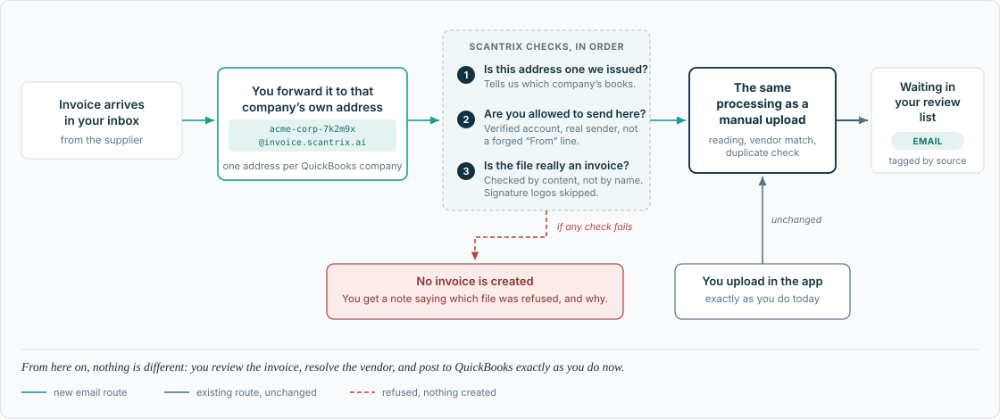

# Scantrix Web App

A Next.js (App Router) web port of the Scantrix mobile app — AI-assisted
invoice scanning, QuickBooks sync, and team management for small
businesses.

## Invoice forwarding by email



Each QuickBooks company gets its own receiving address. Forward a supplier
invoice to it and it enters the *same* pipeline a manual upload uses — extraction,
vendor matching, duplicate checks, review, then posting. Email is an extra front
door, not a second system.

One address per company is also how an accountant keeps several clients apart:
the address decides which books an invoice lands in, so nobody chooses at forward
time.

- **Set it up / test it:** [`EMAIL_FORWARDING_DEPLOY.md`](./EMAIL_FORWARDING_DEPLOY.md)
- **Design and contracts:** [`EMAIL_INVOICE_INGESTION_ARCHITECTURE.md`](./EMAIL_INVOICE_INGESTION_ARCHITECTURE.md)
  (§0 records where the original design was wrong)

Off by default: set `INBOUND_EMAIL_ENABLED=true` plus the other `INBOUND_*`
variables in `.env.local.example`.

## What this is

This repo is a genuine web-native re-implementation of the mobile app at
`~/Scantrix_v2` (React Native/Expo, branch `frontend-ui-v2`) — not a
wrapper or a WebView shell. The **logic layer** (Redux slices for
auth/invoice/vendor/quickBooks, the API client, storage, session
handling) was ported first and lives in `src/store/` and `src/lib/`; the
**UI layer** in `src/app/`, `src/components/` was then built fresh for
web, screen by screen, matching the mobile app's actual behavior and API
contracts, adapted for desktop-web interaction patterns where mobile
patterns don't translate (see "Design decisions" below).

There was no PRD for this port — the mobile app's source code was the
requirements document. Every non-obvious decision made in its place is
recorded in `ASSUMPTIONS.md`.

## How this maps to Scantrix_v2

| This repo | Mobile source | Notes |
|---|---|---|
| `/login`, `/register`, `/register/verify-otp` | `LoginScreen`, `CreateAccountScreen`, `VerifyOTPScreen` | |
| `/dashboard` | `DashboardScreen` | Upload is a file input, not a camera/gallery/PDF sheet |
| `/invoices?type=` | `InvoiceListScreen` | Query param instead of a route param |
| `/invoices/[id]` | `InvoiceDetailsScreen` | |
| `/invoices/[id]/review` | `InvoiceReviewScreen` | |
| `/invoices/[id]/vendor` | `VendorResolutionScreen` | |
| `/invoices/pending` | `PendingInvoicesScreen` | |
| `/invoices/preview` | `InvoicePreviewScreen.web.tsx` | Mobile already ships a web variant; ported directly |
| `/quickbooks` | (split out of `AccountingSoftwaresScreen`) | Connect/switch/disconnect, as its own page |
| `/accounting-software` | `AccountingSoftwaresScreen` | QuickBooks status card + Tally/Zoho (Coming Soon) + Google Drive (mock) |
| `/team` | `TeamMembersScreen` | |
| `/invite/accept` | `InviteAcceptScreen` | |
| `/profile`, `/profile/edit` | `ProfileOptionsScreen`, `EditProfileScreen` | |
| `/plans`, `/subscription`, `/paywall` | `PlansScreen`, `SubscriptionStatusScreen`, `SubscriptionPaywallScreen` | All three are UI mockups on mobile too — no real billing |
| Sidebar app shell | — | New: mobile has no persistent nav (`MainTabNavigator` is a single-screen stack) |

`STATUS.md` has the full mobile-screen-by-screen inventory this port
was built against. `PROGRESS.md` is the append-only build log (one
line per completed task, in order).

## Getting started

```bash
npm install
cp .env.local.example .env.local   # fill in as needed, see below
npm run dev
```

Open [http://localhost:3000](http://localhost:3000).

## Required environment variables

See `.env.local.example` for the full annotated list. Summary:

| Variable | Purpose |
|---|---|
| `NEXT_PUBLIC_API_URL` | Primary Scantrix/Savetrix REST API (auth, invoices, vendors) |
| `NEXT_PUBLIC_QUICKBOOKS_API_URL` | QuickBooks-specific backend (OAuth connect, bill posting) — a different host than the primary API |
| `NEXT_PUBLIC_FIREBASE_*` | Firebase project config (mirrors what's already hardcoded in `src/lib/firebase/config.ts`) |
| `NEXT_PUBLIC_GOOGLE_CLIENT_ID` | Google OAuth Web client ID, used for real Google Sign-In via Google Identity Services |

None of these are secrets in the traditional sense (all are
client-exposed `NEXT_PUBLIC_*` values, safe to ship in a browser
bundle) — `.env.local` is still gitignored as a matter of hygiene, and
`.env.local.example` is the only env file committed.

## Blocked / stubbed items, and why

- **Apple Sign-In (web)** — needs a Services ID + web redirect URIs
  configured in Apple Developer. Not present anywhere in the checked
  sources. Renders a disabled "Coming Soon" button
  (`src/components/auth/AppleSignInButton.tsx`).
- **Google Sign-In (web)** — NOT blocked, despite being pre-marked as
  such before this build started. A real Google OAuth Web client ID
  was found hardcoded in the mobile source (`webClientId` in
  `LoginScreen.tsx`/`CreateAccountScreen.tsx`) and is wired for real
  via Google Identity Services. **Caveat for a human:** that client
  ID's Authorized JavaScript Origins in Google Cloud Console were
  almost certainly configured for mobile ID-token verification, not
  browser sign-in — add this web app's origin(s) there before it will
  work end-to-end. See `ASSUMPTIONS.md` (A7) for the full reasoning.
- **Google Drive connect** — client-side-only mock
  (`src/components/accounting/AccountingSoftwaresContent.tsx`), a
  `localStorage` toggle with no network call. The mobile source
  actually calls a real `/google-drive/connect` + `/google-drive/status`
  backend pair, but wiring that was explicitly out of scope for this
  pass (pre-seeded in `ASSUMPTIONS.md` before the build started) —
  flagged there as a small, well-scoped follow-up if wanted.
- **Delete Account** — real confirmation dialog, but the delete action
  itself is a "Coming Soon" stub (`src/components/profile/ProfileContent.tsx`).
  No backend endpoint exists; this is a real compliance requirement
  (flagged in an earlier App Store audit) needing scoped backend work,
  not a decision for this pass.
- **Subscription / billing (Plans, Subscription status, Paywall)** —
  pure UI mockups with fixed pricing, matching the mobile app's own
  mockup precedent exactly. No payment processor is integrated; every
  plan/upgrade action shows "Preview only — full subscription flow
  coming soon."
- **Vercel deployment** — never automated by this build; a human
  decision after review.

## Design decisions worth knowing about

- **Design tokens**: `src/app/globals.css`'s `@theme` block ports
  mobile's `colors.ts`/`spacing.ts`/`typography.ts`/`radius.ts`
  verbatim. Every screen references these tokens, not hardcoded hex —
  correcting an inconsistency the mobile app itself had drifted into.
- **App shell**: mobile has no persistent navigation (`MainTabNavigator`
  is a single-screen stack). The left sidebar (`src/components/shell/AppShell.tsx`)
  is new information architecture built for this port, not a mobile
  pattern being carried over.
- **`window.alert`/`window.confirm`**: stands in for React Native's
  `Alert.alert` everywhere (notices and destructive-action
  confirmations) — no toast/dialog library was added for this pass.
- **Two real cross-platform bugs found and fixed** while wiring file
  uploads: `scanInvoice` (invoice upload) and `updateProfileIcon`
  (profile photo upload) both inherited a React-Native-only
  `{uri, name, type}` FormData shape from the logic-layer port, which
  cannot work in a real browser. Both now take a browser `File`
  directly.

Full reasoning behind every judgment call above (and many smaller
ones) is in `ASSUMPTIONS.md`.
